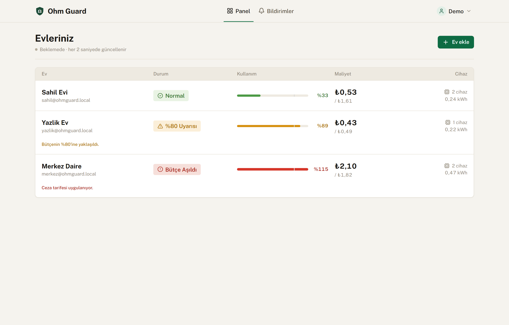
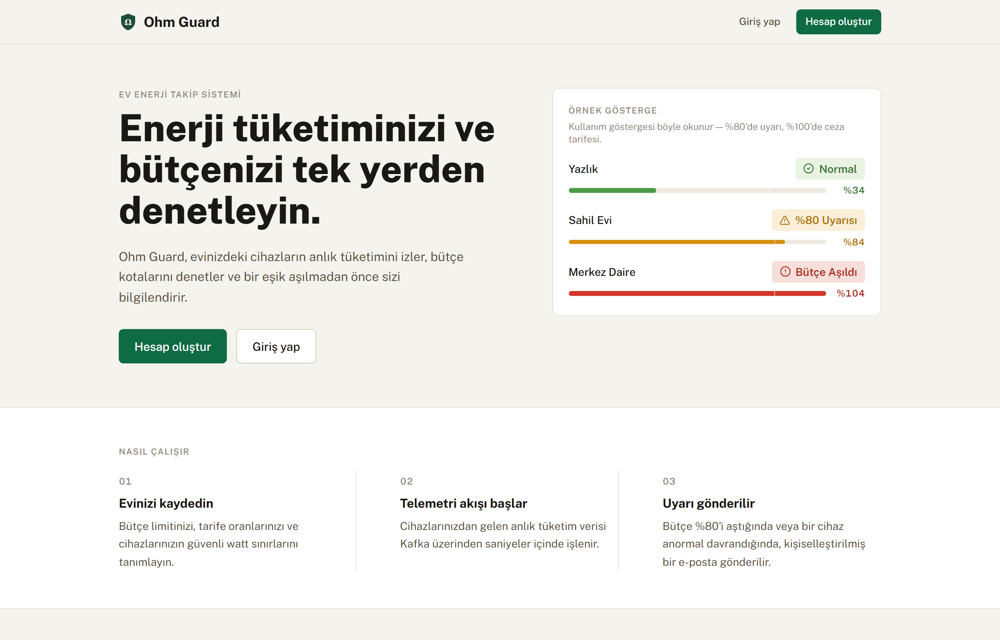
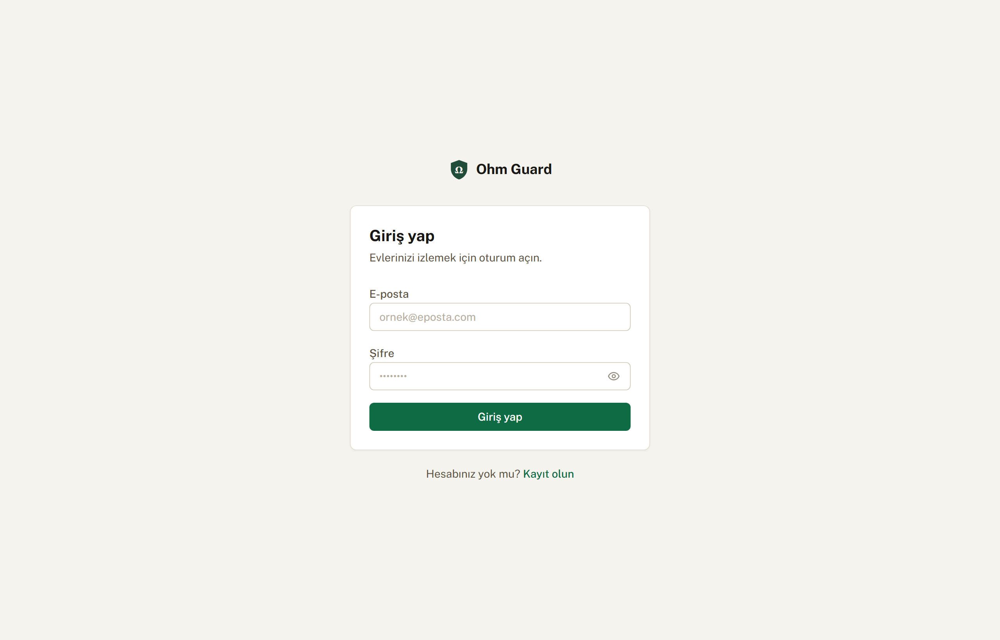
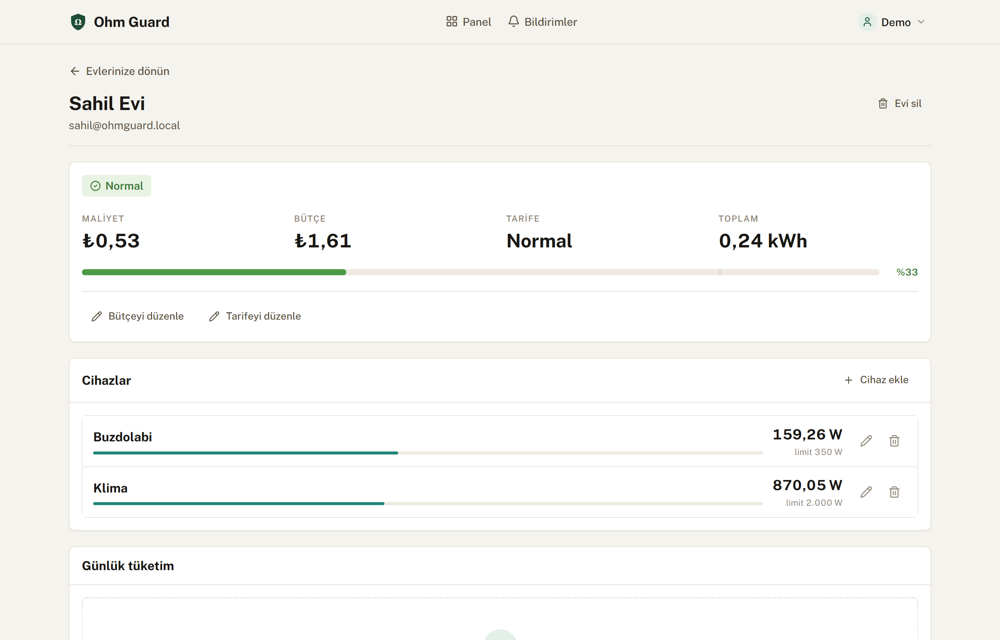
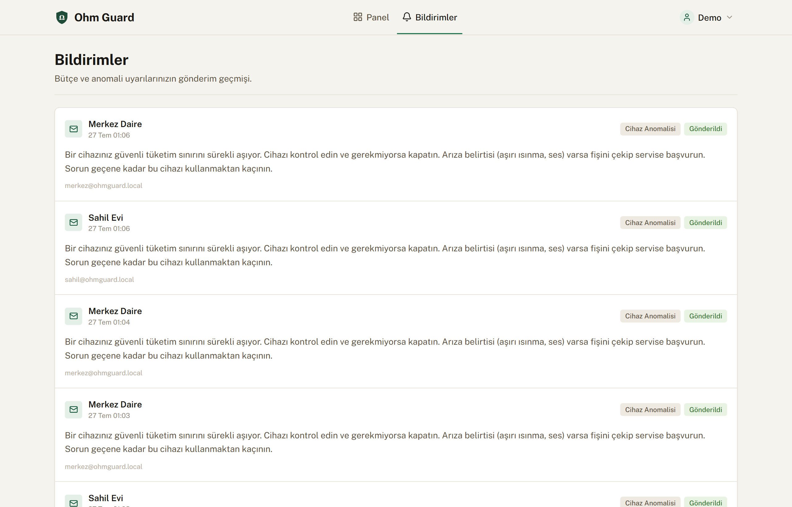
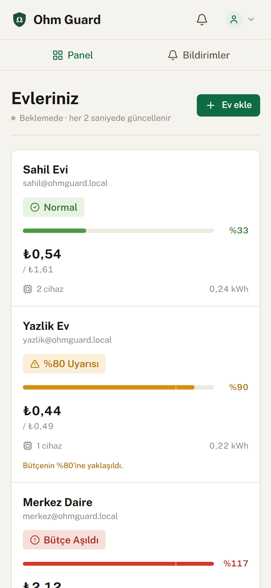
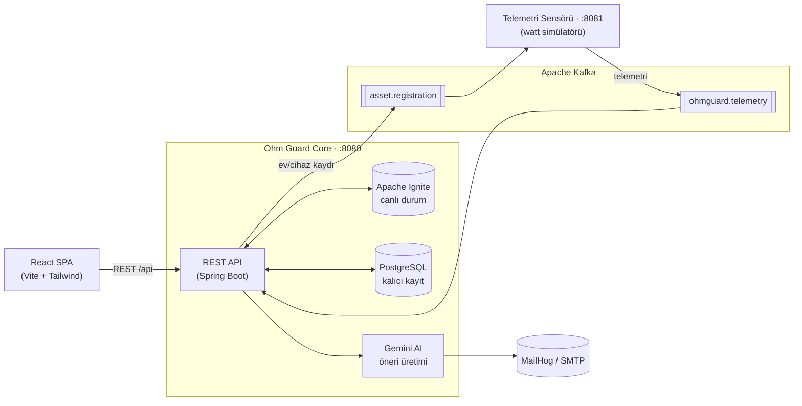

<div align="center">


# ⚡ Ohm Guard

**Gerçek zamanlı ev enerji izleme, bütçe denetimi ve yapay zekâ destekli uyarı platformu**

Evlerinizdeki cihazların anlık tüketimini izler, bütçe kotalarını denetler, cihaz
anomalilerini yakalar ve bir eşik aşılmadan önce sizi kişiselleştirilmiş bir e-posta ile uyarır.

<br/>


<br/>


</div>

<br/>

<div align="center">
  
</div>

<br/>

## ✨ Öne Çıkanlar

- **Canlı tüketim paneli** — Tüm evlerinizin anlık kWh ve maliyet durumu; panel her 2, ev detayı her 1,5 saniyede kendini yeniler (kesintisiz, titremesiz).
- **Bütçe & kota denetimi** — Her ev için aylık bütçe limiti; %80'de uyarı, %100'de otomatik **ceza tarifesine** geçiş.
- **Cihaz anomali tespiti** — Bir cihaz güvenli watt limitini üst üste aşarsa (3 ardışık ölçüm) otomatik anomali olarak işaretlenir.
- **Yapay zekâ destekli bildirimler** — Google Gemini, ev bazlı verilerden yola çıkarak size özel Türkçe tasarruf/uyarı metni yazar; e-posta ile gönderilir.
- **4 kademeli durum sistemi** — Normal · %80 Uyarısı · Cihaz Anomalisi · Bütçe Aşıldı; renk **tek başına** değil, ikon + etiket + metinle birlikte iletilir (erişilebilirlik).
- **Tam CRUD** — Ev ekle/sil, cihaz ekle/sil, bütçe & tarife & güvenli-watt limitini düzenle.
- **Gerçek kimlik doğrulama** — JWT tabanlı kayıt/giriş, korumalı rotalar, oturum geri yükleme, 401 yakalama.
- **Editoryal-utility tasarım** — Sıcak taş zemin, orman yeşili vurgu, tek humanist yazı tipi; responsive (masaüstü → mobil), erişilebilir, karanlık kalıp/gradient yok.

<br/>

## 🖼️ Ekran Görüntüleri

| Karşılama | Giriş |
|---|---|
|  |  |

| Ev detayı (canlı cihazlar) | Bildirimler (AI önerileri) |
|---|---|
|  |  |

<div align="center">
  
  <br/><em>Mobil görünüm</em>
</div>

<br/>

## 🏗️ Mimari



**Akış:** Sensör her registered cihaz için gerçekçi watt telemetrisi üretir → Kafka → Core, veriyi **Ignite**'ta atomik olarak işler (anlık kWh/maliyet, kota & anomali kararları) ve **PostgreSQL**'e kalıcılaştırır. Bir eşik aşıldığında Core, **Gemini**'den Türkçe öneri alıp e-posta ile gönderir. Frontend yalnızca REST API üzerinden konuşur.

<br/>

## 🧰 Teknoloji Yığını

| Katman | Teknolojiler |
|---|---|
| **Backend** | Java 17, Spring Boot 3.3, Spring Data JPA, Spring Kafka, Spring Mail |
| **Canlı durum** | Apache Ignite 2.18 (embedded, in-memory EntryProcessor'lar) |
| **Veritabanı** | PostgreSQL 16 (`ddl-auto=none`, `schema.sql` otoriter) |
| **Mesajlaşma** | Apache Kafka + Zookeeper (telemetri & kayıt topic'leri) |
| **Yapay zekâ** | Google Gemini (`gemini-flash-latest`) |
| **Frontend** | React 19, TypeScript, Vite 8, React Router 7, TanStack Query 5 |
| **UI** | Tailwind CSS 4, Radix UI primitifleri, Recharts, Lucide, React Hook Form + Zod |
| **Altyapı** | Docker Compose (Kafka, Zookeeper, MailHog), Nginx (reverse proxy) |

<br/>

## 🚀 Kurulum & Çalıştırma

### Gereksinimler
- Java 17+ ve Maven (proje `./mvnw` ile gelir)
- Node.js 18+ ve npm
- Docker & Docker Compose
- Yerelde çalışan PostgreSQL (`localhost:5432`, veritabanı `ohmguard_db`)

### 1) Sırları tanımlayın

Proje kökünde `config/secret.properties` oluşturun (bu dosya gitignore'ludur):

```properties
spring.datasource.password=POSTGRES_SIFRENIZ
jwt.secret=uzun-rastgele-bir-jwt-anahtari
gemini.api-key=GEMINI_API_ANAHTARINIZ
```

> Alternatif olarak aynı değerleri ortam değişkeni biçiminde bir `.env` dosyasında da tutabilirsiniz. `application.properties` aşağıdaki değişkenleri okur (varsayılanlarıyla):

| Değişken | Varsayılan | Açıklama |
|---|---|---|
| `DB_URL` | `jdbc:postgresql://localhost:5432/ohmguard_db` | PostgreSQL bağlantısı |
| `DB_USERNAME` / `DB_PASSWORD` | `postgres` / — | DB kimlik bilgileri |
| `JWT_SECRET` | — | JWT imzalama anahtarı |
| `JWT_EXPIRATION` | `315360000000` | Token ömrü (ms) |
| `KAFKA_BOOTSTRAP_SERVERS` | `localhost:9092` | Kafka adresi |
| `GEMINI_API_KEY` | — | Google AI Studio anahtarı |
| `GEMINI_MODEL` | `gemini-flash-latest` | Kullanılacak model |
| `MAIL_HOST` / `MAIL_PORT` | `localhost` / `1025` | SMTP (MailHog) |

### 2) Altyapıyı başlatın (Kafka, Zookeeper, MailHog)

```bash
docker compose up -d
```

### 3) Core backend'i çalıştırın (:8080)

```bash
./mvnw spring-boot:run
```

### 4) Frontend'i çalıştırın (:5173)

```bash
cd frontend
npm install
npm run dev
```

> Frontend, API adresini `VITE_API_BASE_URL` ortam değişkeninden okur (`frontend/.env.local` → `VITE_API_BASE_URL=http://localhost:8080`).

### 5) (Opsiyonel) Telemetri sensörü

Canlı telemetri, ayrı bir Spring Boot servisi olan **Ohm Guard Sensor** tarafından üretilir (port `:8081`, yalnızca Kafka ile konuşur). Sensör çalışmadan da uygulama açılır; sadece canlı watt verisi akmaz.

Uygulamaya **http://localhost:5173** adresinden erişin. Gelen e-postalar için MailHog: **http://localhost:8025**.

<br/>

## 🔌 API Özeti

Tüm uçlar `/api` önekiyle başlar. Kimlik doğrulama gereken uçlar `Authorization: Bearer <token>` bekler.

| Metot | Uç | Auth | Açıklama |
|---|---|:---:|---|
| `POST` | `/api/auth/create-account` | — | Hesap oluştur |
| `POST` | `/api/auth/login` | — | Giriş (JWT döner) |
| `GET` | `/api/auth/me` | ✅ | Mevcut kullanıcı |
| `GET` | `/api/home/dashboard/mine` | ✅ | Kullanıcının evleri + canlı durum |
| `POST` | `/api/home/create-full` | ✅ | Ev + cihazları tek istekte oluştur |
| `DELETE` | `/api/home/mine/{homeId}` | ✅ | Evi sil |
| `GET` | `/api/home/status?homeId=` | — | Ev canlı durumu (Ignite) |
| `PUT` | `/api/home/update/budget-limit` | ✅ | Bütçe limitini güncelle |
| `PUT` | `/api/home/update/tariff-rates` | ✅ | Tarife oranlarını güncelle |
| `POST` | `/api/appliances/add` | ✅ | Cihaz ekle |
| `PUT` | `/api/appliances/update/safe-watt-limit` | ✅ | Güvenli watt limitini güncelle |
| `DELETE` | `/api/appliances/delete?homeId=&applianceId=` | ✅ | Cihaz sil |
| `GET` | `/api/consumption-service/daily-history?homeId=` | — | Günlük tüketim geçmişi |
| `GET` | `/api/notifications/mine` | ✅ | Kullanıcıya ait AI bildirimleri |

> Swagger arayüzü: **`/swagger-ui.html`** · OpenAPI: **`/v3/api-docs`**

<br/>

## 📁 Proje Yapısı

```
i2i-academy-ohmGuard-2/
├── src/main/java/...            # Core backend (paket-per-domain)
│   ├── auth/  homes/  appliances/  billing_accounts/
│   ├── anomaly_events/  quota_events/  tariff_events/
│   ├── consumption_snapshots/  email_notifications/  ai_recommendations/
│   ├── ignite/                  # canlı durum (EntryProcessor'lar)
│   ├── kafka/                   # telemetri consumer + kayıt publisher
│   └── zcommon/                 # JWT, CORS, hata yönetimi
├── src/main/resources/
│   ├── application.properties
│   └── db/schema.sql
├── frontend/                    # React + TypeScript SPA
│   └── src/{app,pages,layouts,features,components,lib,types}
├── docker-compose.yml           # Kafka + Zookeeper + MailHog
└── docs/screenshots/
```

<br/>

## 🌐 Dağıtım

Üretim ortamı tek bir sunucuda şöyle koşar:

- **Nginx** (`:80`) → frontend build'ini (`dist/`) servis eder, `/api` isteklerini Core'a proxy'ler.
- **Core** ve **Sensor**, `systemd` servisleri olarak (`java -jar`).
- **PostgreSQL, Kafka, Zookeeper, MailHog** → Docker Compose.

Frontend'i üretim için relatif API tabanıyla derleyip (`VITE_API_BASE_URL=`), aynı origin üzerinden Nginx ile sunmak yeterlidir.

<br/>

## 📝 Notlar

- Günlük tüketim grafiği, her gece yarısı çalışan bir cron ile dolar; yeni eklenen bir evde ilk nokta ertesi gün görünür.
- E-posta bildirimleri yerel geliştirmede **MailHog**'a düşer (gerçek SMTP yapılandırılmamıştır).
- Sırlar hiçbir zaman repoya girmez (`config/secret.properties` ve `.env` gitignore'ludur).

<br/>

<div align="center">
  <sub>i2i Academy eğitim projesi · Ohm Guard</sub>
</div>
